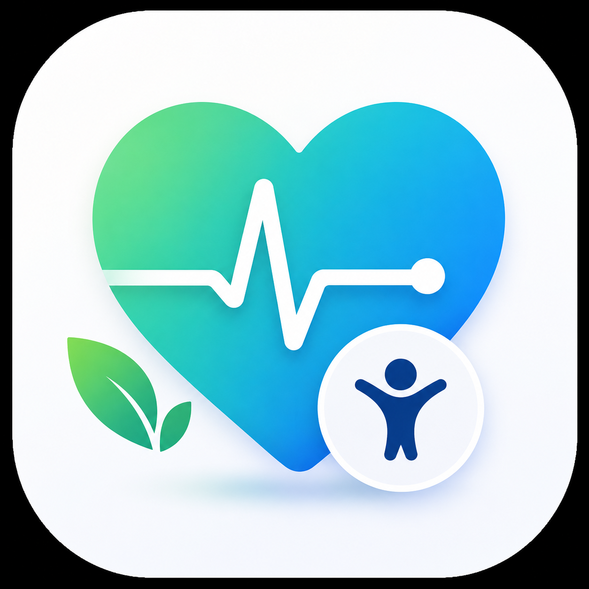

# Healthbar

A mobile calorie and nutrition tracking app, built with Expo and React Native.

Work in progress. The interface is largely built out, authentication works, and the data layer is still partly mocked.

<p align="center">
  
</p>

---

## What it does

**Daily tracking.** A home screen with calorie and macro rings, a food diary organised by meal, and an insights tab with weekly trends.

**Food logging.** Search across a food list, or build a custom dish ingredient by ingredient with calories and macros computed as you go.

**Coach.** A conversational nutrition assistant that answers questions about the day's intake and suggests what to eat next. It runs against a local Ollama instance, so nothing leaves the machine.

**Accounts.** Email and password sign-up, Google sign-in, guided onboarding to set goals, and a full settings section covering profile, units, dietary preferences, reminders, permissions and privacy.

**Subscription tiers.** Free, ad-free, and pro, with subscription and payment screens in place.

---

## Stack

| Layer | Choice |
| --- | --- |
| Framework | Expo, React Native, TypeScript |
| Navigation | Expo Router, file-based |
| Auth and backend | Supabase, session persisted with AsyncStorage |
| State | React Context, `AppContext` and `AuthContext` |
| AI coach | Ollama, `llama3.2`, running locally |
| Payments | Stripe React Native |

---

## Project layout

```txt
mobile/
  app/
    (auth)/        Sign-in and sign-up
    (tabs)/        Home, diary, insights, coach
    *.tsx          Onboarding, settings, search, dish creation
  components/ui/   Reusable interface pieces
  context/         App and auth state
  constants/       Theme tokens and food data
  services/        Supabase client
  utils/           Helpers and the Ollama client
  ios/             Native iOS project
```

---

## Running it

From the `mobile` directory:

```bash
npm install
npm start
```

Or straight onto a device:

```bash
npm run ios
npm run android
```

### Environment

Create a `.env` in `mobile/`:

```bash
EXPO_PUBLIC_SUPABASE_URL=your_project_url
EXPO_PUBLIC_SUPABASE_ANON_KEY=your_anon_key
```

### Coach

The coach needs Ollama running locally on port 11434:

```bash
ollama pull llama3.2
ollama serve
```

Without it, every other part of the app still works.

---

## Current limitations

The food list is a static set in `constants/data.ts` rather than a real database, and the coach's system prompt still carries placeholder daily stats instead of reading live values from the app state. Both are the next things to wire up.

Nutrition figures are approximate and the coach is a prototype. Not a substitute for advice from a dietitian or a doctor.
